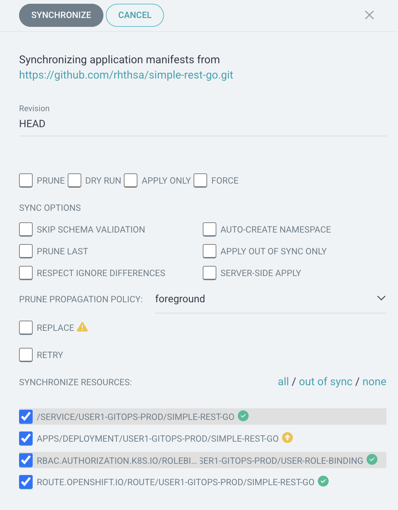

# Continuous Delivery (CD) with OpenShift GitOps (ArgoCD)
<!-- TOC -->

- [Continuous Delivery (CD) with OpenShift GitOps (ArgoCD)](#continuous-delivery-cd-with-openshift-gitops-argocd)
  - [What is GitOps?](#what-is-gitops)
  - [About GitOps](#about-gitops)
  - [About Red Hat OpenShift GitOps](#about-red-hat-openshift-gitops)
  - [Review Deployment Configuration in Git Repository \& Kustomized Configuration Management](#review-deployment-configuration-in-git-repository--kustomized-configuration-management)
  - [Review Kustomize Resource in Git Repository](#review-kustomize-resource-in-git-repository)
  - [Create Applicaiton in OpenShift GitOps](#create-applicaiton-in-openshift-gitops)
  - [Summary](#summary)
  - [Next Step](#next-step)

<!-- /TOC -->
<!-- /TOC -->

## What is GitOps?

GitOps uses Git repositories as a single source of truth to deliver infrastructure as code. Submitted code checks the CI process, while the CD process checks and applies requirements for things like security, infrastructure as code, or any other boundaries set for the application framework. All changes to code are tracked, making updates easy while also providing version control should a rollback be needed.

GitOps delivers:

* A standard workflow for application development
* Increased security for setting application requirements upfront
* Improved reliability with visibility and version control through Git
* Consistency across any cluster, any cloud, and any on-premise environment
Many other tools can be used together to build a GitOps framework. For example, git repositories, Kubernetes, continuous integration/continuous delivery (CI/CD) tools, and configuration management tools.

## About GitOps

GitOps is a declarative way to implement continuous deployment for cloud native applications. You can use GitOps to create repeatable processes for managing OpenShift Container Platform clusters and applications across multi-cluster Kubernetes environments. GitOps handles and automates complex deployments at a fast pace, saving time during deployment and release cycles.

The GitOps workflow pushes an application through development, testing, staging, and production. GitOps either deploys a new application or updates an existing one, so you only need to update the repository; GitOps automates everything else.

GitOps is a set of practices that use Git pull requests to manage infrastructure and application configurations. In GitOps, the Git repository is the only source of truth for system and application configuration. This Git repository contains a declarative description of the infrastructure you need in your specified environment and contains an automated process to make your environment match the described state. Also, it contains the entire state of the system so that the trail of changes to the system state are visible and auditable. By using GitOps, you resolve the issues of infrastructure and application configuration sprawl.

GitOps defines infrastructure and application definitions as code. Then, it uses this code to manage multiple workspaces and clusters to simplify the creation of infrastructure and application configurations. By following the principles of the code, you can store the configuration of clusters and applications in Git repositories, and then follow the Git workflow to apply these repositories to your chosen clusters. You can apply the core principles of developing and maintaining software in a Git repository to the creation and management of your cluster and application configuration files.

## About Red Hat OpenShift GitOps

Red Hat OpenShift GitOps ensures consistency in applications when you deploy them to different clusters in different environments, such as: development, staging, and production. Red Hat OpenShift GitOps organizes the deployment process around the configuration repositories and makes them the central element. It always has at least two repositories:

1. Application repository with the source code

2. Environment configuration repository that defines the desired state of the application

These repositories contain a declarative description of the infrastructure you need in your specified environment. They also contain an automated process to make your environment match the described state.

Red Hat OpenShift GitOps uses Argo CD to maintain cluster resources. Argo CD is an open-source declarative tool for the continuous integration and continuous deployment (CI/CD) of applications. Red Hat OpenShift GitOps implements Argo CD as a controller so that it continuously monitors application definitions and configurations defined in a Git repository. Then, Argo CD compares the specified state of these configurations with their live state on the cluster.

Argo CD reports any configurations that deviate from their specified state. These reports allow administrators to automatically or manually resync configurations to the defined state. Therefore, Argo CD enables you to deliver global custom resources, like the resources that are used to configure OpenShift Container Platform clusters.

## Review Deployment Configuration in Git Repository & Kustomized Configuration Management

* Start with [Kustomized](https://kustomize.io)
  
  
  
  Kustomize provides a solution for customizing Kubernetes resource   configuration free from templates and DSLs.

  Kustomize lets you customize raw, template-free YAML files for multiple purposes, leaving the original YAML untouched and usable as is.

  Kustomize targets kubernetes; it understands and can patch kubernetes style API objects. It’s like make, in that what it does is declared in a file, and it’s like sed, in that it emits edited text.

  With kustomize, your team can ingest any base file updates for your underlying components while keeping use-case specific customization overrides intact. Another benefit of utilizing patch overlays is that they add dimensionality to your configuration settings, which can be isolated for troubleshooting misconfigurations or layered to create a framework of most-broad to most-specific configuration specifications.

  To recap, Kustomize relies on the following system of configuration management layering to achieve reusability:

  - Base Layer - Specifies the most common resources
  - Patch Layers - Specifies use case specific resources
  
    
    

## Review Kustomize Resource in Git Repository

- For this workshop, we will deploy `simple-rest-go` application agian by Red Hat OpenShift GitOps
  
- open browser to [https://github.com/rhthsa/simple-rest-go.git](https://github.com/rhthsa/simple-rest-go.git)
  
  
  
- go to /apps-kustomize
  
  
  
- go to base folder
  
  
  
  - review following file:
    - kustomization.yaml
    - rolebinding.yaml
    - deployment.yaml
    - service.yaml
    - route.yaml

- go to overlays/dev folder
  
  
  
  - review following file:
    - kustomization.yaml
    - deployment.yaml
  
- content of deployment.yaml in overlays/dev/kustomization.yml
  
  
  
- compare content of deployment.yaml between base folder and overlays/dev folder (about replica)
    
  

- go to overlays/prod folder
  
  
  
  - review following file:
    - kustomization.yaml
    - deployment.yaml
  
- compare content of deployment.yaml between base folder and overlays/dev folder (about replica)
    
  

- summary kustomize structure of this workshop

  

## Create Applicaiton in OpenShift GitOps

- Open your developer console, go to your project 'userX-gitops-dev' (replace X with your username)
- Go to top right of developer console, Navigate to the table menu (It's to the left of the plus sign menu.) --> OpenShift GitOps --> Cluster Argo CD.
  
  
  
- Use local user for login, type your username and password (same with your openshift login), click `SIGN IN`
  
  
  
- Review Argo CD Console, Click `+ New App`
  
  

- In create application, Input `userX-go-dev` to Application Name (change X to your username)
- set `default` to Project Name
- set `Manual` to SYNC POLICY
  
  

- In SOURCE section, input `https://github.com/rhthsa/simple-rest-go.git` to Repository URL
- set Revision to `HEAD`
- set Path to `apps-kustomize/overlays/dev`

  

- In Destination section, select first cluster (from dropdownlist) to Cluster URL
- set Namespace to `userX-gitops-dev` (change X to your username)
  
  

- leave default last part, click Create
  
  

- Back to Main page, set filter in namespace to `userX*` (change X to your username), this help filter your app in page.
  
  

- Review application in Applications page
  
  

- Click `userX-go-dev` to view details of application
  
  

- click `sync` to synchronize application to cluster
  
  

- wait until App Health change to `Healthy`, Sync status to `Synced`, Last sync to `Sync OK`, check number of pod in this deployment (2 Pods)
  
  

- Change from Tree view to Pods view, to Network view and List view to see kubernetes object in each view.

  Pods view
  
  
  
  Network view
  
  
  
  List view
  
  

- Create Application for Production, back to Applications, click `+ NEW APP`
- set Application Name to `userX-go-prod` (change X to your username)
- set Project Name to `default`
- set SYNC POLICY to `Manual`

  

- In SOURCE section, input `https://github.com/rhthsa/simple-rest-go.git` to Repository URL
- set Revision to `HEAD`
- set Path to `apps-kustomize/overlays/prod`
  
   

- In Destination section, select first cluster (from dropdownlist) to Cluster URL
- set Namespace to `userX-gitops-prod` (change X to your username)

  

- leave default last part, click Create
  
  

- View new applicaiton in applications view, click `userX-go-prod` (change x to your username)

  

- Click Sync and wait until sync complete, check number of Pods (3 Pods)
  
      
  
- back to OpenShift Console, view topology in `userX-gitops-dev` project (change X to your username), check number of pods.
    
  

- view topology in `userX-gitops-prod` project (change X to your username), check number of pods.
  
  

- In `userX-gitops-prod` project, try to reduce replica of deployment by, click in Details tab of `simple-rest-go` deployment, and click scale down from 3 to 2

  

- Back to ArgoCD, view `userX-go-prod` application, Status change to `OutOfSync`, Click to view Detail
  
      

- In applicaiton detail, click diff button
  
  

- check `compact diff` and `inline diff` to view diff between current state on Cluster and yaml file on Git
  
  

- Click Sync button, Click Synchronize to update deployment to value from Git.

  

- Back to OpenShift Developer Console, Review number of replica again.
  
    
    
## Summary

OpenShift GitOps takes advantage of Argo CD and integrates it into Red Hat OpenShift to deliver a consistent, fully supported, declarative Kubernetes platform to configure and use with GitOps principles.

OpenShift and OpenShift GitOps:

- Apply consistency across cluster and deployment lifecycles
- Consolidate administration and management of applications across on-premises and cloud environments
- Check the state of clusters making application constraints known early
- Rollback code changes across clusters
- Roll out new changes submitted via Git
- Support advanced deployment strategies, including blue green and canary, using automated traffic management and testing capabilities with [Argo Rollouts](https://argoproj.github.io/rollouts/).

## Next Step
- [OpenShift Observability - Logging](observe-logging.md)

