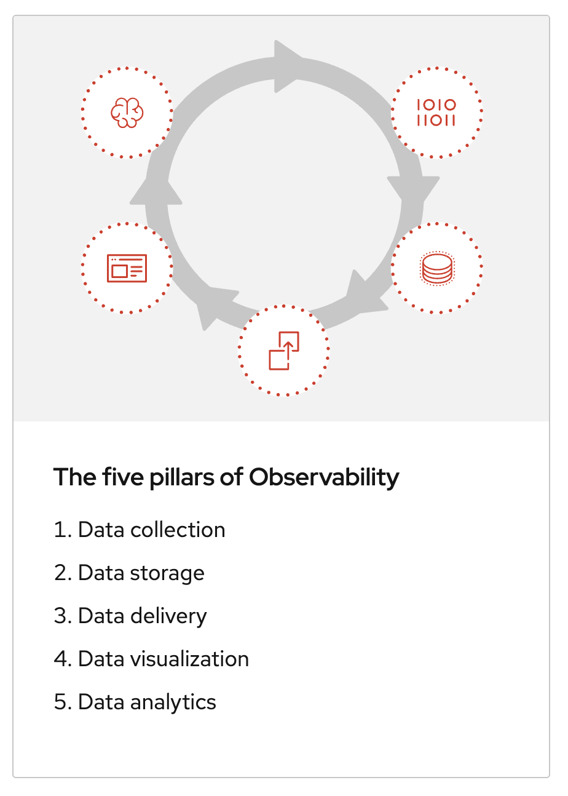

# COpenShift Observability - Logging
<!-- TOC -->

- [COpenShift Observability - Logging](#copenshift-observability---logging)
  - [What is OpenShift Observability?](#what-is-openshift-observability)
  - [OpenShift Logging](#openshift-logging)
  - [Summary](#summary)
  - [Next Step](#next-step)

<!-- /TOC -->
<!-- /TOC -->

## What is OpenShift Observability?

[Red Hat® OpenShift® Observability](https://www.redhat.com/en/topics/devops/what-is-observability) is a comprehensive set of observability capabilities that provides deep insights into the performance and health of OpenShift-based applications and infrastructure across any footprint: the public cloud, on-prem, and edge.

Red Hat OpenShift Observability provides real-time visibility, monitoring, and analysis of various system metrics, logs, traces, and events to help you quickly diagnose and troubleshoot issues before they impact your applications or end users.

It streamlines metrics, traces and logs, while aggregating and transporting your data. Red Hat OpenShift Observability allows you to gain visibility into your clusters through efficient user interfaces and empowers your teams to make data-driven decisions.

With our balanced approach and 5 pillars, you can monitor capabilities and optimize your infrastructure seamlessly.

## OpenShift Logging
    
## Summary

OpenShift GitOps takes advantage of Argo CD and integrates it into Red Hat OpenShift to deliver a consistent, fully supported, declarative Kubernetes platform to configure and use with GitOps principles.

## Next Step
- [OpenShift Observability - Monitoring](observe-monitor.md)

