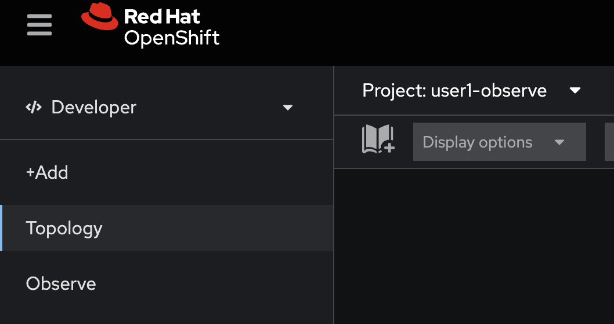
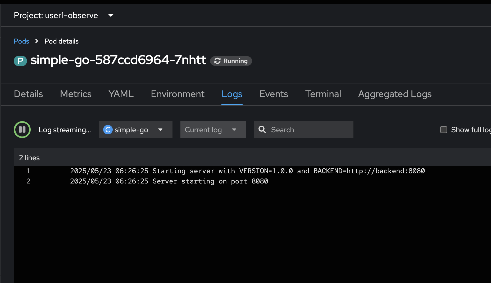
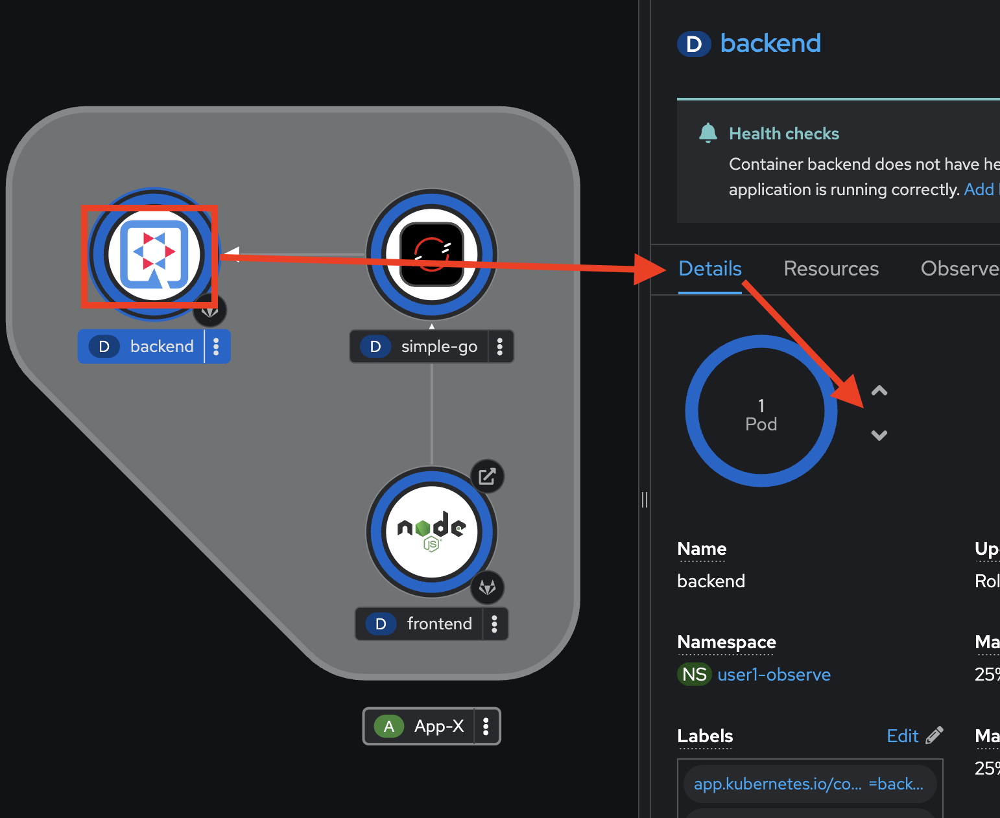
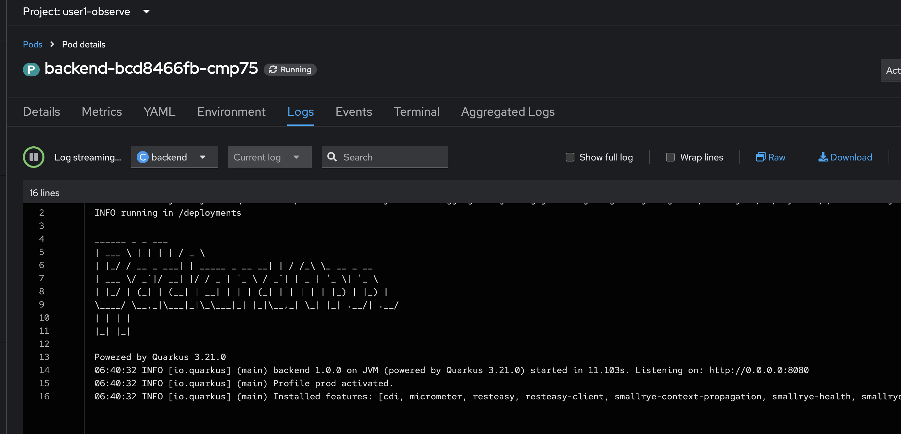

# OpenShift Observability - Logging
<!-- TOC -->

- [OpenShift Observability - Logging](#openshift-observability---logging)
  - [What is OpenShift Observability?](#what-is-openshift-observability)
  - [OpenShift Logging](#openshift-logging)
  - [Logging resources](#logging-resources)
  - [Review Source Code and Deployment Configuration of Sample Application](#review-source-code-and-deployment-configuration-of-sample-application)
  - [Deploy Sample Application](#deploy-sample-application)
  - [Try to Test Built-in Log view in OpenShift Developer Console](#try-to-test-built-in-log-view-in-openshift-developer-console)
  - [Troubel Shoot with OpenShift Logging](#troubel-shoot-with-openshift-logging)
  - [Summary](#summary)
  - [Next Step](#next-step)

<!-- /TOC -->
<!-- /TOC -->

## What is OpenShift Observability?

[Red Hat® OpenShift® Observability](https://www.redhat.com/en/topics/devops/what-is-observability) is a comprehensive set of observability capabilities that provides deep insights into the performance and health of OpenShift-based applications and infrastructure across any footprint: the public cloud, on-prem, and edge.

Red Hat OpenShift Observability provides real-time visibility, monitoring, and analysis of various system metrics, logs, traces, and events to help you quickly diagnose and troubleshoot issues before they impact your applications or end users.

It streamlines metrics, traces and logs, while aggregating and transporting your data. Red Hat OpenShift Observability allows you to gain visibility into your clusters through efficient user interfaces and empowers your teams to make data-driven decisions.

With our balanced approach and 5 pillars, you can monitor capabilities and optimize your infrastructure seamlessly.

Features and Benefits

## OpenShift Logging

With OpenShift Container Platform, you can deploy OpenShift Logging to aggregate all the logs from your OpenShift Container Platform cluster, such as node system audit logs, application container logs, and infrastructure logs. OpenShift Logging aggregates these logs from throughout your cluster and stores them in a default log store. 

OpenShift Logging aggregates the following types of logs:

- application - Container logs generated by user applications running in the cluster, except infrastructure container applications.
- infrastructure - Logs generated by infrastructure components running in the cluster and OpenShift Container Platform nodes, such as journal logs. Infrastructure components are pods that run in the openshift*, kube*, or default projects.
- audit - Logs generated by auditd, the node audit system, which are stored in the /var/log/audit/audit.log file, and the audit logs from the Kubernetes apiserver and the OpenShift apiserver.

## Logging resources

- ClusterLogging (CL) , After the Operators are installed, you create a ClusterLogging custom resource (CR) to schedule logging pods and other resources necessary to support the logging. The ClusterLogging CR deploys the collector and forwarder, which currently are both implemented by a daemonset running on each node. The Red Hat OpenShift Logging Operator watches the ClusterLogging CR and adjusts the logging deployment accordingly.

- ClusterLogForwarder (CLF) - Generates collector configuration to forward logs per user configuration. Based on [Vector](https://github.com/vectordotdev/vector)

- [LokiStack](https://grafana.com/oss/loki/) - Controls the Loki cluster as log store and the web proxy with OpenShift Container Platform authentication integration to enforce multi-tenancy.

Loki is a horizontally scalable, highly available, multi-tenant log aggregation system offered as a GA log store for logging for Red Hat OpenShift that can be visualized with the OpenShift Observability UI. The Loki configuration provided by OpenShift Logging is a short-term log store designed to enable users to perform fast troubleshooting with the collected logs. For that purpose, the logging for Red Hat OpenShift configuration of Loki has short-term storage, and is optimized for very recent queries. For long-term storage or queries over a long time period, users should look to log stores external to their cluster.

Logging for Red Hat OpenShift is an opinionated collector and normalizer of application, infrastructure, and audit logs. It is intended to be used for forwarding logs to various supported systems.

Need more details about OpenShift Logging --> [Link](https://docs.redhat.com/en/documentation/openshift_container_platform/4.18/html/logging/logging-6-2)

## Review Source Code and Deployment Configuration of Sample Application

- Review Deployment Config from https://github.com/rhthsa/developer-advocacy-2025/tree/main/config
  
  

- Review Deployment and Service of backend application or `backend.yaml` (Develop with [Java Quarkus](https://quarkus.io/))

  

- Review Deployment and Service of simple-go application or `simple-go.yaml` (Develop with [Golang](https://go.dev/))
  
  

- Review in Deployment of `simple-go.yaml`, view environment variable `BACKEND`, this deployment will call to backend with this URL.
  
    

- Review Deployment, Service and Route of frontend application or `frontend.yaml` (Develop with [Node.js](https://nodejs.org/en))

  

- Review in Deployment of `frontend.yaml`, view environment variable `BACKEND_URL`, this deployment will call to simple-go with this URL.
  
  

- Review Source Code of `backend` application from [https://gitlab.com/ocp-demo/backend_quarkus](https://gitlab.com/ocp-demo/backend_quarkus)

  

- Review Source Code of `BackendResource.java` in `/code/src/main/java/com/example/quarkus`

  

- Example of Logging code in [Java Quarkus](https://quarkus.io/guides/logging)

  

- Review Source Code of `simple-go` application from [https://gitlab.com/ocp-demo/backend_quarkus](https://github.com/rhthsa/simple-rest-go.git)
 
  

- Review Source Code of `main.go`

  

  

- Review Source Code of `frontend` application from [https://gitlab.com/ocp-demo/frontend-js](https://gitlab.com/ocp-demo/frontend-js)

    

- Review Source Code of `server.js`

    

## Deploy Sample Application

- Back to OpenShift Developer Console, select `userX-observe` project (change X to your username)
  
    

- click Import YAML 

    

- copy YAML from `backend.yaml` from [https://github.com/rhthsa/developer-advocacy-2025/tree/main/config](https://github.com/rhthsa/developer-advocacy-2025/tree/main/config) and paste in Import YAML

    

- click Create, and wait util all complete.
  
    

- Review Deployment in Topology view

  

- Click Import YAML, copy YAML from `simple-go.yaml` from [https://github.com/rhthsa/developer-advocacy-2025/tree/main/config](https://github.com/rhthsa/developer-advocacy-2025/tree/main/config) and paste in Import YAML
  
    

- click Create, and wait util all complete.
  
    

- Review Deployment in Topology view

  

- Click Import YAML, copy YAML from `frontend.yaml` from [https://github.com/rhthsa/developer-advocacy-2025/tree/main/config](https://github.com/rhthsa/developer-advocacy-2025/tree/main/config) and paste in Import YAML
  
    

- click Create, and wait util all complete.
  
    

- Review Deployment in Topology view

  

## Try to Test Built-in Log view in OpenShift Developer Console

- Click `backend` Deployment, right click `view logs` of Pods in Resources tab, open link in new tab.

    

- View log in Logs tab in Pods Details

    

- Click `simple-go` Deployment, right click `view logs` of Pods in Resources tab, open link in new tab.

    

- View log in Logs tab in Pods Details

    

- Click `frontend` Deployment, right click `view logs` of Pods in Resources tab, open link in new tab.

    

- View log in Logs tab in Pods Details

  

- Click Open URL in `frontend` Deployment

  

- View Output of frontend application, try to refresh 2-3 times
  
  

- Review Logs of frontend application (from previous open tab)

  

  if log don't show, please check `Log steam paused` and click Run.

  

- Review Logs of simple-go application (from previous open tab)
  
  

- Review Logs of backend application (from previous open tab)
    
    

- Try to restart pod, click `backend` deployment, select details tab, click scale down from `1 Pod` to `0 Pod`

    

- wait until Pod scale down to `0`

    

- scale up to `1` again

    

- Reopen view logs of `backend` deployment agian

    

- Review `backend` application log, The Old Logs is gone! How to Trouble Shoot with log after log is gone!

      

## Troubel Shoot with OpenShift Logging

- Go to Observe Menu, Logs Tab, view all log in this namespace/project.

  

- Try to fileter with Pods, select all `backend` pods. click Run Query Button.
  
  

- Click Show Resources, to view Namesapce, Pod and Container of each log data.  
  
  

- Click clear filter and show query, paste `{ log_type="application", kubernetes_namespace_name="userX-observe", kubernetes_container_name=~"backend" } | json` in query text box (change X to your username), click Run Query to find all logs from `backend` container in your namesapce.
  
  

- Paste `{ log_type="application", kubernetes_namespace_name="userX-observe" } |= `BackendResource` | json` in query text box (change x to your username) to find all logs coming from `BackendResource`

    

## Summary

OpenShift's logging capabilities offer significant benefits for containerized applications and overall platform management. These benefits include centralized log collection, enhanced security and compliance, and streamlined troubleshooting and debugging. OpenShift's logging features streamline the development process by providing a consistent and standardized approach to logging. 

## Next Step
- [OpenShift Observability - Monitoring](observe-monitor.md)