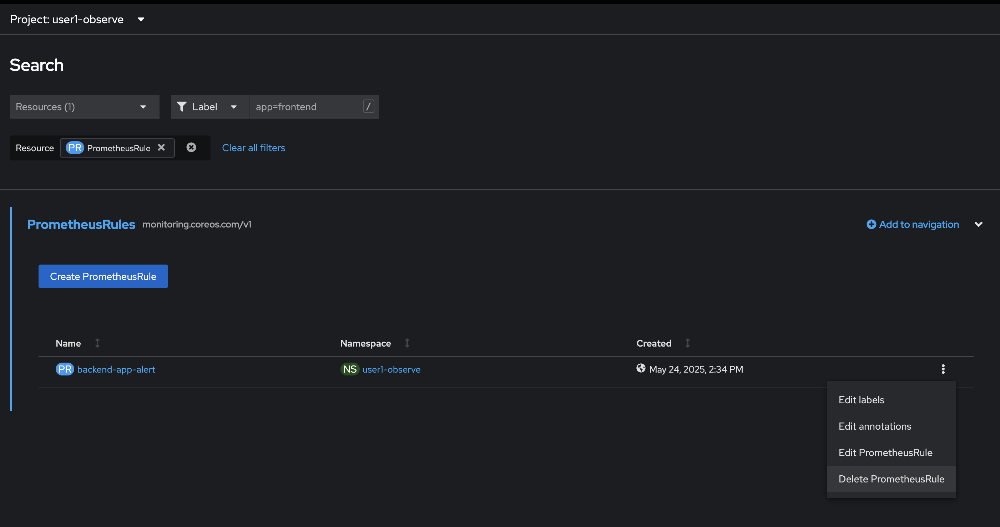

# OpenShift Observability - Monitoring
<!-- TOC -->

- [OpenShift Observability - Monitoring](#openshift-observability---monitoring)
  - [What is OpenShift Monitoring?](#what-is-openshift-monitoring)
  - [Monitoring stack architecture](#monitoring-stack-architecture)
  - [OpenShift Default Monitoring](#openshift-default-monitoring)
  - [Review Application Performance Metric Code](#review-application-performance-metric-code)
  - [Add Application Performance Metric to OpenShift](#add-application-performance-metric-to-openshift)
  - [Add Alert to OpenShift Monitoring](#add-alert-to-openshift-monitoring)
  - [Summary](#summary)
  - [Next Step](#next-step)

<!-- /TOC -->
<!-- /TOC -->
  - [Summary](#summary)
  - [Next Step](#next-step)

<!-- /TOC -->

## What is OpenShift Monitoring?

OpenShift Container Platform includes a preconfigured, preinstalled, and self-updating monitoring stack that provides monitoring for core platform components. You also have the option to enable monitoring for user-defined projects.

A cluster administrator can configure the monitoring stack with the supported configurations. OpenShift Container Platform delivers monitoring best practices out of the box.

A set of alerts are included by default that immediately notify administrators about issues with a cluster. Default dashboards in the OpenShift Container Platform web console include visual representations of cluster metrics to help you to quickly understand the state of your cluster. With the OpenShift Container Platform web console, you can access metrics and manage alerts.

After installing OpenShift Container Platform, cluster administrators can optionally enable monitoring for user-defined projects. By using this feature, cluster administrators, developers, and other users can specify how services and pods are monitored in their own projects. As a cluster administrator, you can find answers to common problems such as user metrics unavailability and high consumption of disk space by Prometheus in Troubleshooting monitoring issues.

## Monitoring stack architecture

The OpenShift Container Platform monitoring stack is based on the Prometheus open source project and its wider ecosystem. The monitoring stack includes default monitoring components and components for monitoring user-defined projects.

The monitoring stack includes the following components:

- `Default platform monitoring components.` A set of platform monitoring components are installed in the openshift-monitoring project by default during an OpenShift Container Platform installation. This provides monitoring for core cluster components including Kubernetes services. The default monitoring stack also enables remote health monitoring for clusters.

These components are illustrated in the Installed by default section in the following diagram.

- `Components for monitoring user-defined projects.` After optionally enabling monitoring for user-defined projects, additional monitoring components are installed in the openshift-user-workload-monitoring project. This provides monitoring for user-defined projects. These components are illustrated in the User section in the following diagram.


For more information --> [Link](https://docs.redhat.com/en/documentation/openshift_container_platform/4.18/html/monitoring/about-openshift-container-platform-monitoring)

## OpenShift Default Monitoring

- In OpenShift Developer Console, Select project `userX-observe` (change X to your username),
- View default monitoring per deployment, click topology, click `backend` deployment, in backend deployment, select observe tab
  - view CPU usage,
  - view Memory usage
  - bandwidth
  
  

  

- Or view monitoring per pod, change to Resources tab, and click Pod to view details

  

- In Pod Details, change to Metrics tab to view Memory usage, CPU usage, Filesystem and Network In of this pod.

  

- To view default monitoring of all deployment in this project, click Observe in left menu, select Dashboard Tab, default dashboard will show monitoring of all pod in this namespace. 

  

- You can change view by select Dashboard and criteria such as select `Kubernetes/Compute Resources/Pod` and specific pod

  

- view default monitoring such as CPU Usage, CPU Throttling, CPU Quota, etc.

  

- select tab Metrics to view performance/metrics information by type, click select query dropdown list to select default metrics information such as cpu usage, memory usage, filesystem usage, etc. 

  

- select CPU usage, click check box 'Stacked'
  
  

- change to another metrics such as memory usage.

- OpenShift Monitoring base on Prometheus Technology, you can use PromQL for retrive metric information, in query text box,  type 'container_cpu' and wait auto suggestion,
   
  

- select 'container_cpu_usage_seconds_total' and type 'enter' button to view this metrics from PromQL
  
  

- type 'pod:container_cpu_usage:sum' and type 'enter' button to view this metrics from PromQL

  

- You can save this page for later use.

  
 
- click Alerts tab to view all alert (the Alerting UI enables you to manage alerts, silences, and alerting rules, we will create alert in next step in this session)

  

- click Events Tab to view All event in this project or filter by resource

  

## Review Application Performance Metric Code

Developer can enable monitoring for user-defined projects in addition to the default platform monitoring. You can now monitor your own projects in OpenShift Container Platform without the need for an additional monitoring solution. 

- review application metric code
  - backend application use quarkus microprofile metrics libraly to generate application metrics
  - example code: [https://gitlab.com/ocp-demo/backend_quarkus](https://gitlab.com/ocp-demo/backend_quarkus), 
  - example custom metrics in code: path `/code/src/main/java/com/example/quarkus/BackendResource.java`

    

    

  - In Maven Repository of Project (pom.xml)
    
    

    

- review example metrics of backend application, in topology view, click `backend` deployment, and click on pod

  

- select terminal tab, try to run curl command

  ```ssh
  curl -s http://localhsot:8080/q/metrics
  ```
  

  example result

  

- call custom quarkus microprofile metrics example

  ```ssh
  curl -s  http://localhost:8080/q/metrics/application
  ```
  example result

    

## Add Application Performance Metric to OpenShift

- create ServiceMonitor, go to Search in left menu, in search page, in resources drop down, type 'servicemonitor' for filter, click 'SM ServiceMonitor'

    

- Click Create ServiceMonitor button

   

- in Create ServiceMonitor Page, input below YAML for create ServiceMonitor to backend application

  ```yaml
  apiVersion: monitoring.coreos.com/v1
  kind: ServiceMonitor
  metadata:
    labels:
      k8s-app: backend-monitor
    name: backend-monitor
  spec:
    endpoints:
    - interval: 30s
      port: http
      path: /q/metrics
      scheme: http
    - interval: 30s
      port: http
      path: /q/metrics/application
      scheme: http
    selector:
      matchLabels:
        app: backend  
  ```

  example: 

   

- click create and review your ServiceMonitor, click YAML tab to view your yaml code. 
  
   

- test call you backend application
- open web terminal. test call your backend 2-3 times (change X to your username)

  ```bash
  oc project userX-observe
  curl http://backend:8080
  ```

  such as

   

- click Observe in left menu, select Metrics Tab

   

- in PromQL, type `com` and wait auto suggesstion

   

- Remark: if you don't found metrics 'com*' in auto suggession, wait a few minute and retry again

- select from suggestion or type in query box with `com_example_quarkus_BackendResource_countBackend_total`, type enter.

   

- change your custom PromQL to average call backend service in 1 minute is   
  - type: `rate(com_example_quarkus_BackendResource_countBackend_total[1m])`
  - enter
  
     
  
- Perfect!!! you can add metrics to OpenShift Monitoring Now.
- Optional: test call backend 2-3 times and check metrics change in Monitoring Pages

## Add Alert to OpenShift Monitoring

- Check Example `PrometheusRule` (change X to your username before create)
 
  ```yaml
  apiVersion: monitoring.coreos.com/v1
  kind: PrometheusRule
  metadata:
    name: backend-app-alert
    namespace: userX-observe
    labels:
      openshift.io/prometheus-rule-evaluation-scope: leaf-prometheus
  spec:
    groups:
    - name: backend
      rules:
      - alert: HighLatency
        expr: com_example_quarkus_BackendResource_timeBackend_seconds_max>0.1
        labels:
          severity: 'critical'
        annotations:
          message: '{{ $labels.instance }} response time is {{ $value }} sec'
  ```

  HightLatency Alert will fire when response time is greateer than 1 sec  

- Create backend-app-alert, click Import YAML

   
  
- input PrometheusRule yaml in editor and create (change `namespace!!!` before run)
- open web terminal. test call your backend 2-3 times
- go to Observe menu, Alerts tab, and wait until it's show! (may be need refresh page.)

   

- View in Topology, see alert icon on backend application

    
  
- Delete prometheusrule before go to next step, use search menu, and filter with `PrometheusRule`, click Delete in Action.
   
     
  
## Summary

OpenShift Monitoring provides real-time visibility into cluster health and performance using integrated tools like Prometheus, AlertManager, etc. It helps detect issues early, ensuring high availability and reliability of applications. The built-in alerting system enables proactive response and efficient resource management.

## Next Step
- [OpenShift Observability - Tracing](observe-otel.md)