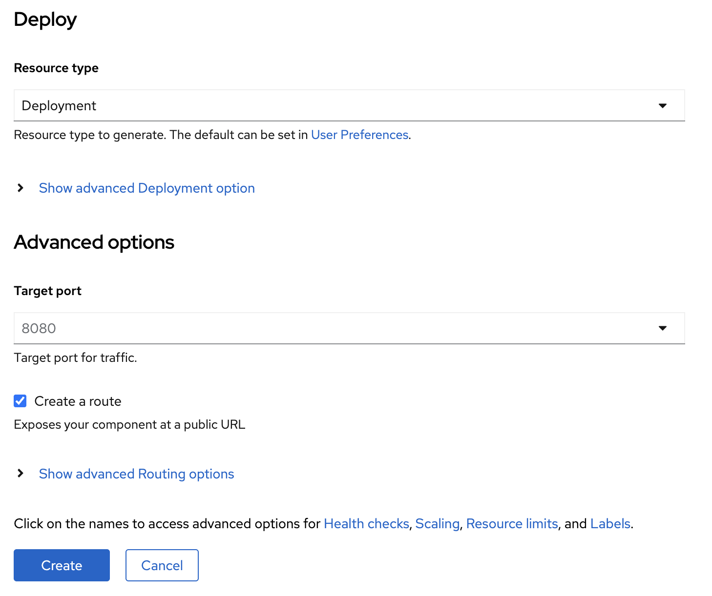
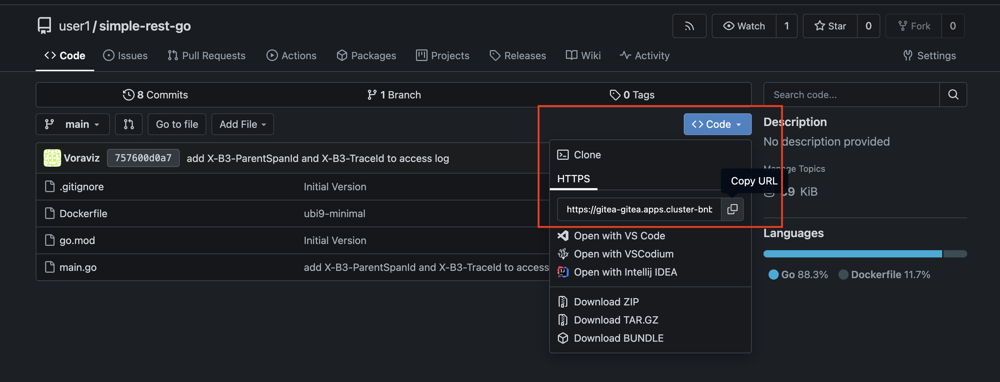
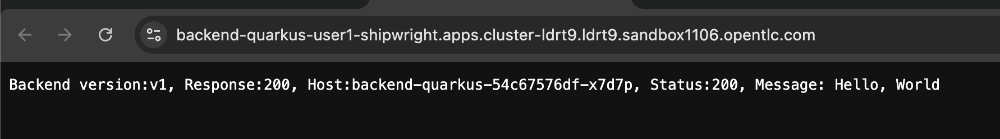
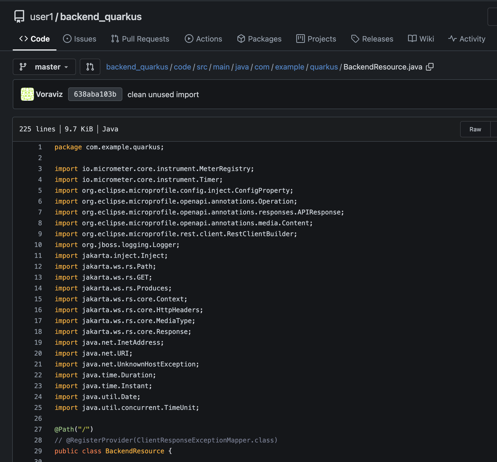
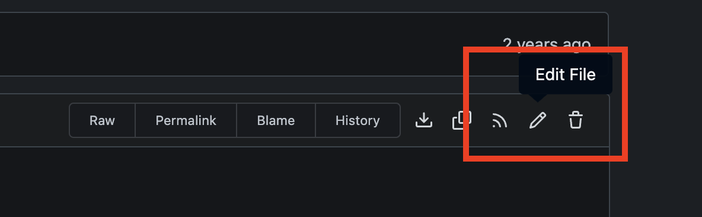
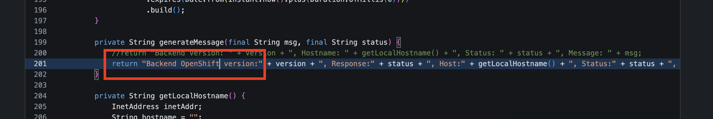

# Builds for Red Hat OpenShift
<!-- TOC -->

- [Builds for Red Hat OpenShift](#builds-for-red-hat-openshift)
  - [Deploy Container Application on OpenShift with Container Image](#deploy-container-application-on-openshift-with-container-image)
    - [open browser to OpenShift Console](#open-browser-to-openshift-console)
    - [Set Default OpenShift Console!!!](#set-default-openshift-console)
    - [Deploy Container Image](#deploy-container-image)
    - [We can deploy container image in OpenShift Console but What 's happen? if you don't have container image!!!](#we-can-deploy-container-image-in-openshift-console-but-what-s-happen-if-you-dont-have-container-image)
  - [The future of Red Hat OpenShift builds](#the-future-of-red-hat-openshift-builds)
  - [Deploy Application with Shipwright Buildah (Build from Container File/Docker File)](#deploy-application-with-shipwright-buildah-build-from-container-filedocker-file)
    - [Review Container File from Git Repository](#review-container-file-from-git-repository)
    - [Build Container with Shipwright-Buildah and Deploy to OpenShift](#build-container-with-shipwright-buildah-and-deploy-to-openshift)
  - [Deploy Application with Shipwright S2I (Build from Source Code with Source-to-Image)](#deploy-application-with-shipwright-s2i-build-from-source-code-with-source-to-image)
    - [Review Source from Git Repository](#review-source-from-git-repository)
    - [Build Container with Shipwright-S2I and Deploy to OpenShift](#build-container-with-shipwright-s2i-and-deploy-to-openshift)
  - [Summary](#summary)
  - [Next Step](#next-step)

<!-- /TOC -->
<!-- /TOC -->
<!-- /TOC -->
<!-- /TOC -->
<!-- /TOC -->
<!-- /TOC -->
<!-- /TOC -->

<!-- /TOC -->
    - [Set Default OpenShift Console!!!](#set-default-openshift-console)
    - [Deploy Container Image](#deploy-container-image)
    - [We can deploy container image in OpenShift Console but What 's happen? if you don't have container image!!!](#we-can-deploy-container-image-in-openshift-console-but-what-s-happen-if-you-dont-have-container-image)
- [Builds for Red Hat OpenShift](#builds-for-red-hat-openshift)
  - [Deploy Container Application on OpenShift with Container Image](#deploy-container-application-on-openshift-with-container-image)
    - [open browser to OpenShift Console](#open-browser-to-openshift-console)
    - [Set Default OpenShift Console!!!](#set-default-openshift-console)
    - [Deploy Container Image](#deploy-container-image)
    - [We can deploy container image in OpenShift Console but What 's happen? if you don't have container image!!!](#we-can-deploy-container-image-in-openshift-console-but-what-s-happen-if-you-dont-have-container-image)
  - [The future of Red Hat OpenShift builds](#the-future-of-red-hat-openshift-builds)
  - [Deploy Application with Shipwright Buildah (Build from Container File/Docker File)](#deploy-application-with-shipwright-buildah-build-from-container-filedocker-file)
    - [Review Container File from Git Repository](#review-container-file-from-git-repository)
    - [Build Container with Shipwright-Buildah and Deploy to OpenShift](#build-container-with-shipwright-buildah-and-deploy-to-openshift)
  - [Deploy Application with Shipwright S2I (Build from Source Code with Source-to-Image)](#deploy-application-with-shipwright-s2i-build-from-source-code-with-source-to-image)
    - [Review Source from Git Repository](#review-source-from-git-repository)
    - [Build Container with Shipwright-S2I and Deploy to OpenShift](#build-container-with-shipwright-s2i-and-deploy-to-openshift)
  - [Summary](#summary)
  - [Next Step](#next-step)

<!-- /TOC -->

## Deploy Container Application on OpenShift with Container Image

### open browser to OpenShift Console

- confirm URL from instructor

- login to openshift with your username/password
  
  - username: `xxx` --> get from register page
  - password: `xxx` --> get from register page
  
  

- if login first time, dev console will launch developer quick tour, click Skip tour
  
  

- select Developer Perspective from left menu (if openshift don't default page for you)

  

- select 'userX-shipwright' project `change userX to your username such as user1`

### Set Default OpenShift Console!!!
- click user at top-right of OpenShift Console, select User References

  

- In General Section, you can change theme from dark mode (default) to light mode

  

### Deploy Container Image

- click `+Add` in left menu, in Add page, select Container images

  

- select `image name from external registry`
- input `quay.io/voravitl/frontend-js:latest` in text box, and wait until openshift validate complete!
- change Runtime icon to `nodejs`
- set Application name to `frontend-js`
- set Name to `frontend-js`

  

- set Resource type to `Deployment`
- leave default Target port, Create Route and other, click Create
  
  

- wait until Pods change to `Running` 

  

- Click on `frontend-js` Deployment icon click on Open URL

  
  
- Review Application `frontend-js`  

  
 
### We can deploy container image in OpenShift Console but What 's happen? if you don't have container image!!!

- How to build container from your source code!
- How to build container from your container file!
- How to prepare tools, environment, etc. to build container!

## The future of Red Hat OpenShift builds


Builds is an extensible build framework based on the Shipwright project, which you can use to build container images on an OpenShift Container Platform cluster. You can build container images from source code and Dockerfiles by using image build tools, such as Source-to-Image (S2I) and Buildah. You can create and apply build resources, view logs of build runs, and manage builds in your OpenShift Container Platform namespaces.

Builds includes the following capabilities:

- Standard Kubernetes-native API for building container images from source code and Dockerfiles
- Support for Source-to-Image (S2I), Buildah, Buildpacks, etc.
- Extensibility with your own custom build strategies
- Execution of builds from source code in a local directory
- Shipwright CLI for creating and viewing logs, and managing builds on the cluster
- Integrated user experience with the Developer perspective of the OpenShift Container Platform web console

Builds consists of the following custom resources (CRs):

- Build
- BuildStrategy and ClusterBuildStrategy
- BuildRun

Get More information 

- [Builds for Red Hat OpenShift 1.4](https://docs.redhat.com/en/documentation/builds_for_red_hat_openshift/1.4/)
- [Shipwright](https://github.com/shipwright-io/build)
- [Project Shipwright and the future of Red Hat OpenShift builds](https://developers.redhat.com/articles/2021/06/14/project-shipwright-and-future-red-hat-openshift-builds#)

## Deploy Application with Shipwright Buildah (Build from Container File/Docker File)

### Review Container File from Git Repository
  
- Get Git Url from Command Line, click web terminal link at top right of developer console.
  
  
  
- for first time. select `userX-shipwright` (change X to your username) project and click start.

  

- wait until terminal ready and show command line prompt!
  
  

- run command to get gitea url.

  ```ssh
  oc get route gitea -n gitea
  ```

  example result

  ```ssh
  NAME    HOST/PORT                                                      PATH   SERVICES   PORT    TERMINATION     WILDCARD
  gitea   gitea-gitea.apps.cluster-bnb6v.bnb6v.sandbox1016.opentlc.com          gitea      <all>   edge/Redirect   None
  ```

- copy host of gitea to new tab browser 
  
  

- login with your username, but password is `openshift`

   

- click `simple-rest-go` repository
  
   

- select `Dockerfile`, review build step in Dockerfile

   
  
   

- back to `simple-rest-go` repository, get git URL from code button and select copy url

   

### Build Container with Shipwright-Buildah and Deploy to OpenShift

- click `+Add` in left menu, and select `Git Repository - Import from Git`

   

- Import from Git page, 
- Input git URL (from previous copy) in Git Repo URL, such as `https://gitea-gitea.apps.cluster-ldrt9.ldrt9.sandbox1106.opentlc.com/user1/simple-rest-go.git`
- Wizard will detect Dockerfile automatic
- set Application to `Create Application`
- set Application name to `simple-rest-go`
- set Name to `simple-rest-go`
  
   

- set Build option to `Builds for OpenShift (Shipwright)
- set Cluster Build Strategy to `Buildah`
- leave other default, click Create

   

- After back to Topology page, select `simple-rest-go` deployment, go to BuildRuns, click View logs 

   

- In BuildRuns, view logs from Buildah
  
  

- wait until it change from Running to Succeded.  
   
   

- Click Builds, Shipwright Builds, To view previous `Build`
  
   

- Back to Topology, view deployment, pod after build complete.
  
   

- Click Open URL to test call container application
  
   

- Example Result from `simple-rest-go`
  
     

## Deploy Application with Shipwright S2I (Build from Source Code with Source-to-Image)

### Review Source from Git Repository

- Back to Git, go to `backend_quarkus` Repository

     
  
- Review Project Structure of `backend_quarkus`
  
     

- Copy git URL of `backend_quarkus` by click Code Button and click copy URL
  
       

- click on code folder (source code of this project)
    
         
  
- review `BackendResource.java` under `code/src/main/java/com/example/quarkus`
  
     

### Build Container with Shipwright-S2I and Deploy to OpenShift

- Back to OpenShift Developer Console, click `+Add` in left menu and select Git Repository - Import from Git
- In Import from Git, 
- Input git URL (from previous copy) to Git Repo URL such as `https://gitea-gitea.apps.cluster-ldrt9.ldrt9.sandbox1106.opentlc.com/user1/backend_quarkus.git`
- Input `/code` in Context dir
  
     

- Wizard will auto detect Builder image, click Edit Import Strategy

       

- In Import Strategy, select Builder Image, Java and openjdk-21-ubi9
  
    

- In Application, select Create application
- Input `backend-quarkus` in Application name
- Input `backend-quarkus` in Name
- select `Builds for OpenShift (Shipwright)` in Build Option
- select `Source-to-image` in Cluster Build Strategy 
  
     

- leave other default value, click Create Button

     

- Back to Topology page, `backend-quarkus` Deployment, click view logs in BuildRuns
  
       

- Wait Build Running change to Success
  
  
  
       

- Click `Builds` in left menu, In Shipwright Builds Tab, view latest Build

    

- Test Application by back to Topology, view `backend-quarkus` Deployment, 
  
     

- Click view URL, view output in new Browser Tab (Message will start with `Backend version...`)
  
     

- Try to change source code in Git, back to Git, Back to `BackendResource.java`
  
       

- Click Edit File
  
  

- go to line number `201`, change from `Backend version...` to `Backend OpenShift version...`
  
       

- Commit Changes, click Commit Changes
  
    

- Back to Builds, Shipwright Builds, click action menu of `backend-quarkus` Build, select `Start` 
  
     

- Wait until status change to succeeded
  
   
    
       
  
     

- Test Application Again, message will change to `Backend OpenShift version...`

        
    
## Summary

With Shipwright, developers get a simplified approach for building container images, by defining a minimal YAML that does not require any previous knowledge of containers or container tooling. All you need is your source code in git and access to a container registry.

Shipwright supports any tool that can build container images in Kubernetes clusters, such as:

- [Kaniko](https://github.com/GoogleContainerTools/kaniko)
- [Cloud Native Buildpacks](https://buildpacks.io/)
- [BuildKit](https://github.com/moby/buildkit)
- [Buildah](https://buildah.io/)
- [S2I](https://github.com/openshift/source-to-image)


## Next Step
- [Continuous Integration (CI) with OpenShift Pipelines (Tekton)](tekton.md)


