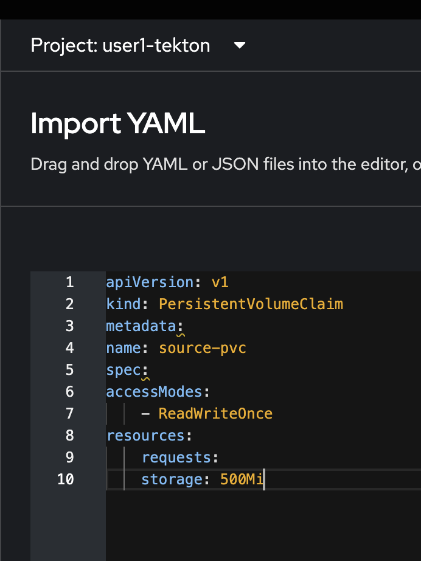
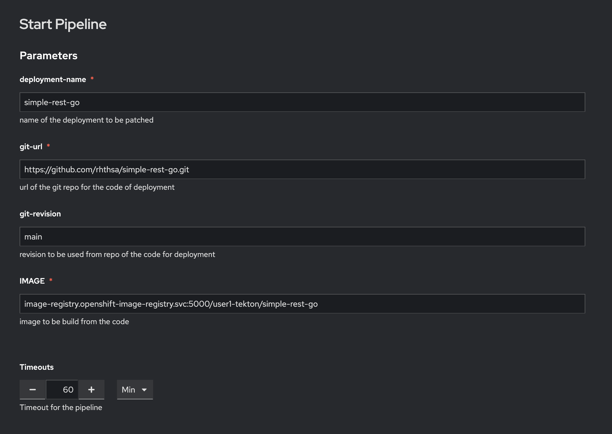
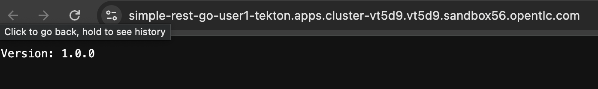

# Continuous Integration (CI) with OpenShift Pipelines (Tekton)
<!-- TOC -->

- [Continuous Integration (CI) with OpenShift Pipelines (Tekton)](#continuous-integration-ci-with-openshift-pipelines-tekton)
  - [Welcome to the OpenShift Pipelines!](#welcome-to-the-openshift-pipelines)
  - [Concepts](#concepts)
  - [Deploy Sample Application with OpenShift Pipelines](#deploy-sample-application-with-openshift-pipelines)
  - [Create Pipeline](#create-pipeline)
  - [Trigger Pipeline](#trigger-pipeline)
  - [Tekton CLI (Optional!)](#tekton-cli-optional)
  - [Add Web Hook for Trigger Pipeline (Optional!)](#add-web-hook-for-trigger-pipeline-optional)
  - [Next Step](#next-step)

<!-- /TOC -->
  - [Add Web Hook for Trigger Pipeline (Optional!)](#add-web-hook-for-trigger-pipeline-optional)
  - [Next Step](#next-step)

<!-- /TOC -->LI (Optional!)](#tekton-cli-optional)
  - [Add Web Hook for Trigger Pipeline (Optional!)](#add-web-hook-for-trigger-pipeline-optional)
  - [Next Step](#next-step)

<!-- /TOC -->

## Welcome to the OpenShift Pipelines!

OpenShift Pipelines is a cloud-native, continuous integration and delivery (CI/CD) solution for building pipelines using [Tekton](https://tekton.dev/). Tekton is a flexible, Kubernetes-native, open-source CI/CD framework that enables automating deployments across multiple platforms (Kubernetes, serverless, VMs, etc) by abstracting away the underlying details.

OpenShift Pipelines features:

- Standard CI/CD pipeline definition based on Tekton
- Build images with Kubernetes tools such as S2I, Buildah, Buildpacks, Kaniko, etc
- Deploy applications to multiple platforms such as Kubernetes, serverless and VMs
- Easy to extend and integrate with existing tools
- Scale pipelines on-demand
- Portable across any Kubernetes platform
- Designed for microservices and decentralized teams
- Integrated with the OpenShift Developer Console

This tutorial walks you through pipeline concepts and how to create and run a simple pipeline for building and deploying a containerized app on OpenShift

## Concepts


Tekton defines a number of [Kubernetes custom resources](https://kubernetes.io/docs/concepts/extend-kubernetes/api-extension/custom-resources/) as building blocks in order to standardize pipeline concepts and provide a terminology that is consistent across CI/CD solutions. These custom resources are an extension of the Kubernetes API that let users create and interact with these objects using kubectl and other Kubernetes tools.

The custom resources needed to define a pipeline are listed below:

- Task: a reusable, loosely coupled number of steps that perform a specific task (e.g. building a container image)
- Pipeline: the definition of the pipeline and the Tasks that it should perform
- TaskRun: the execution and result of running an instance of task
- PipelineRun: the execution and result of running an instance of pipeline, which includes a number of TaskRuns


In short, in order to create a pipeline, one does the following:

- Create custom or install [existing](https://github.com/tektoncd/catalog) reusable Tasks
- Create a Pipeline and PipelineResources to define your application's delivery pipeline
- Create a PersistentVolumeClaim to provide the volume/filesystem for pipeline execution or provide a VolumeClaimTemplate which creates a PersistentVolumeClaim
- Create a PipelineRun to instantiate and invoke the pipeline

For further details on pipeline concepts, refer to the [Tekton documentation](https://github.com/tektoncd/pipeline/tree/master/docs#learn-more) that provides an excellent guide for understanding various parameters and attributes available for defining pipelines.

The Tekton API enables functionality to be separated from configuration (e.g. [Pipelines](https://github.com/tektoncd/pipeline/blob/master/docs/pipelines.md) vs [PipelineRuns](https://github.com/tektoncd/pipeline/blob/master/docs/pipelineruns.md)) such that steps can be reusable.

Triggers extend the Tekton architecture with the following CRDs:

- [TriggerTemplate](https://github.com/tektoncd/triggers/blob/master/docs/triggertemplates.md) - Templates resources to be created (e.g. Create PipelineResources and PipelineRun that uses them)
- [TriggerBinding](https://github.com/tektoncd/triggers/blob/master/docs/triggerbindings.md) - Validates events and extracts payload fields
- [Trigger](https://github.com/tektoncd/triggers/blob/master/docs/triggers.md) - combines TriggerTemplate, TriggerBindings and interceptors.
- [EventListener](https://github.com/tektoncd/triggers/blob/master/docs/eventlisteners.md) - provides an addressable endpoint (the event sink). Trigger is referenced inside the EventListener Spec. It uses the extracted event parameters from each TriggerBinding (and any supplied static parameters) to create the resources specified in the corresponding TriggerTemplate. It also optionally allows an external service to pre-process the event payload via the interceptor field.
- [ClusterTriggerBinding](https://github.com/tektoncd/triggers/blob/master/docs/clustertriggerbindings.md) - A cluster-scoped TriggerBinding

Using tektoncd/triggers in conjunction with tektoncd/pipeline enables you to easily create full-fledged CI/CD systems where the execution is defined entirely through Kubernetes resources.

You can learn more about triggers by checking out the [docs](https://github.com/tektoncd/triggers/blob/master/docs/README.md)

In the following sections, you will go through each of the above steps to define and invoke a pipeline.

## Deploy Sample Application with OpenShift Pipelines

- go to `userX-tekton` Project (Change userX to your username)

  

- OpenShift Pipelines automatically adds and configures a ServiceAccount named `pipeline` that has sufficient permissions to build and push an image. This service account will be used later in the tutorial.

- Open Web Terminal, Run the following command to see the pipeline service account: (Change userX to your username)

  ```ssh
  oc project userX-tekton
  oc get serviceaccount pipeline
  ```

  example result

  

- Try to run tekton command line (For First time, you can replace latest `tkn` command line from OpenShift Cluster! by select `y` )
  
  run command line tekton

  ```ssh
  tkn
  ```
  
  
  
  

- OpenShift Pipelines Operator installs few tasks in namespace openshift-pipelines which you can see., run below command in web terminal

  ```ssh
  tkn tasks ls -n openshift-pipelines
  NAME                      DESCRIPTION              AGE
  buildah                   Buildah task builds...   1 day ago
  git-cli                   This task can be us...   1 day ago
  git-clone                 This object represe...   1 day ago
  maven                     This Task can be us...   1 day ago
  ...
  ```
  
  Tasks consist of a number of steps that are executed sequentially. Tasks are executed/run by creating TaskRuns. A TaskRun will schedule a Pod. Each step is executed in a separate container within the same pod. They can also have inputs and outputs in order to interact with other tasks in the pipeline.

  When a task starts running, it starts a pod and runs each step sequentially in a separate container on the same pod. This task happens to have a single step, but tasks can have multiple steps, and, since they run within the same pod, they have access to the same volumes in order to cache files, access configmaps, secrets, etc. You can specify volume using workspace. It is recommended that Tasks uses at most one writeable Workspace. Workspace can be secret, pvc, config or emptyDir.

  Note that only the requirement for a git repository is declared on the task and not a specific git repository to be used. That allows tasks to be reusable for multiple pipelines and purposes. You can find more examples of reusable tasks in the [Tekton Catalog](https://github.com/tektoncd/catalog) and [OpenShift Catalog](https://github.com/openshift/pipelines-catalog) repositories.

- Install the apply-manifests and update-deployment tasks from the repository using oc or kubectl, which you will need for creating a pipeline in the next section:

- Review [apply_manifest](https://raw.githubusercontent.com/openshift/pipelines-tutorial/master/01_pipeline/01_apply_manifest_task.yaml) 

- Review [update_deployment_task](https://raw.githubusercontent.com/openshift/pipelines-tutorial/master/01_pipeline/02_update_deployment_task.yaml) 

- Run below command to create task 
  
  ```ssh
  oc create -f https://raw.githubusercontent.com/openshift/pipelines-tutorial/master/01_pipeline/01_apply_manifest_task.yaml
  oc create -f https://raw.githubusercontent.com/openshift/pipelines-tutorial/master/01_pipeline/02_update_deployment_task.yaml
  ```

- You can take a look at the tasks you created using the [Tekton CLI](https://github.com/tektoncd/cli/releases): (change userX to your username)

  ```ssh
  oc project userX-tekton
  tkn task ls

  NAME                AGE
  apply-manifests     10 seconds ago
  update-deployment   4 seconds ago
  ```

## Create Pipeline

A pipeline defines a number of tasks that should be executed and how they interact with each other via their inputs and outputs.

In this tutorial, you will create a pipeline that takes the source code of the application from Git and then builds and deploys it on OpenShift.

- Here is the YAML file that represents the above pipeline:

  ```yaml
  apiVersion: tekton.dev/v1
  kind: Pipeline
  metadata:
    name: build-and-deploy
  spec:
    workspaces:
    - name: shared-workspace
    params:
    - name: deployment-name
      type: string
      description: name of the deployment to be patched
    - name: git-url
      type: string
      description: url of the git repo for the code of deployment
    - name: git-revision
      type: string
      description: revision to be used from repo of the code for deployment
      default: master
    - name: IMAGE
      type: string
      description: image to be build from the code
    tasks:
    - name: fetch-repository
      taskRef:
        resolver: cluster
        params:
        - name: kind
          value: task
        - name: name
          value: git-clone
        - name: namespace
          value: openshift-pipelines
      workspaces:
      - name: output
        workspace: shared-workspace
      params:
      - name: URL
        value: $(params.git-url)
      - name: SUBDIRECTORY
        value: ""
      - name: DELETE_EXISTING
        value: "true"
      - name: REVISION
        value: $(params.git-revision)
    - name: build-image
      taskRef:
        resolver: cluster
        params:
        - name: kind
          value: task
        - name: name
          value: buildah
        - name: namespace
          value: openshift-pipelines
      params:
      - name: IMAGE
        value: $(params.IMAGE)
      workspaces:
      - name: source
        workspace: shared-workspace
      runAfter:
      - fetch-repository
    - name: apply-manifests
      taskRef:
        name: apply-manifests
      workspaces:
      - name: source
        workspace: shared-workspace
      runAfter:
      - build-image
    - name: update-deployment
      taskRef:
        name: update-deployment
      params:
      - name: deployment
        value: $(params.deployment-name)
      - name: IMAGE
        value: $(params.IMAGE)
      runAfter:
      - apply-manifests
  ```

- Go to Pipelines Menu, Pipelines tab, Click Create Pipeline
  
  

- Once you deploy the pipelines, you should be able to visualize pipeline flow in the OpenShift Web Console by switching over to the Developer perspective of the OpenShift Web Console. In Pipeline builder, you can create pipeline with GUI or YAML, for this lab switch to YAML view 

    

- In YAML view, paste previous YAML to this editor, review and click create

   
  
- `build-and-deploy` Pipeline will be created, 
      
    

- view Pipeline Parameter in Parameters tab,

    

- In Metrics tab, Pipelines Metrics will help you to monitor performance and status.
  
    

- This pipeline helps you to build and deploy sample application, by configuring right resources to pipeline.

  Pipeline Steps:

  1. Clones the source code of the application from a git repository by referring (git-url and git-revision param)
  2. Builds the container image of application using the buildah task that uses Buildah to build the image
  3. The application image is pushed to an image registry by refering (image param)
  4. The new application image is deployed on OpenShift using the apply-manifests and update-deployment tasks.

  You might have noticed that there are no references to the git repository or the image registry it will be pushed to in pipeline. That's because pipeline in Tekton are designed to be generic and re-usable across environments and stages through the application's lifecycle. Pipelines abstract away the specifics of the git source repository and image to be produced as PipelineResources or Params. When triggering a pipeline, you can provide different git repositories and image registries to be used during pipeline execution. Be patient! You will do that in a little bit in the next section.

  The execution order of tasks is determined by dependencies that are defined between the tasks via inputs and outputs as well as explicit orders that are defined via runAfter.

  workspaces field allows you to specify one or more volumes that each Task in the Pipeline requires during execution. You specify one or more Workspaces in the workspaces field.

- Create PersistentVolumeClaim for share workspace in Pipeline, Click Import YAML from Top Right of Developer Console
  
      

- Paste PersistentVolumeClaim YAML in Editor, click Create
  
  ```yaml
  apiVersion: v1
  kind: PersistentVolumeClaim
  metadata:
    name: source-pvc
  spec:
    accessModes:
      - ReadWriteOnce
    resources:
      requests:
        storage: 500Mi
  ```
  
  Example

   

  PVC after Created

     

## Trigger Pipeline

Now that the pipeline is created, you can trigger it to execute the tasks specified in the pipeline.

A PipelineRun is how you can start a pipeline and tie it to the persistentVolumeClaim and params that should be used for this specific invocation.

- copy git URL of `simple-rest-go` repository from previous lab (Shipwright) such as  `https://gitea-gitea.apps.cluster-ldrt9.ldrt9.sandbox1106.opentlc.com/user1/simple-rest-go.git` 

- Go to Pipelines menu, Pipelines tab, select actio menu for `build-to-deploy` pipeline, select `start`
  
  

- In Start Pipeline, input `simple-rest-go` in deployment-name parameter,
- Input previous copy git url `simple-rest-go` in git-url parameter, (Don't copy from picture!!!)
- Input `main` in git revision  parameter
- Input `image-registry.openshift-image-registry.svc:5000/<project>/simple-rest-go:latest` in Image parameter, change <project> to your username such as user1-tekton
- Leave default timeout

       
  
- In Workspaces, select `PersistentVolumeClaim - source-pvc` for shared-workspace parameter, click start
  
  

- After click start, PipelineRun will be create. you can view detail by click task in PipelineRun details
  
  
  
- view logs from each task and wait until status change to Succeeded!  
  
    
  
  

- Back to Pipeline to view detail of lastest PipelineRun
  
  

- Back to Topology view, view `simple-rest-go` deployment, service and route, click Open URL to test application
  
    
  
    


## Tekton CLI (Optional!)

- Start a pipeline to build and deploy the application using tkn:

    ```ssh
    tkn pipeline start <pipelinename> \
        --prefix-name <prefixname> \
        -w <share_storage> \
        -p <param=value> \
        --use-param-defaults


    Pipelinerun started: <prefixname>-xxxxx

    In order to track the pipelinerun progress run:
    tkn pipelinerun logs <prefixname>-xxxxx -f -n <project>
    ```

- As soon as you start pipeline, a pipelinerun will be instantiated and pods will be created to execute the tasks that are defined in the pipeline.

    ```ssh
    tkn pipeline list
    NAME               AGE              LAST RUN        STARTED          DURATION   STATUS
    build-and-deploy   10 minutes ago   vote-ui-9tb2q   47 seconds ago   ---        Running
    ```

- Above we have started build-and-deploy pipeline, with relevant pipeline resources to deploy the backend/frontend applications using single pipeline

    ```ssh
    tkn pipelinerun ls
    NAME             STARTED         DURATION   STATUS
    vote-ui-9tb2q    1 minute ago    ---        Running
    vote-api-t9tpq   1 minute ago    ---        Running
    ```

- Check out the logs of the pipelinerun as it runs using the tkn pipeline logs command which interactively allows you to pick the pipelinerun of your interest and inspect the logs:

    ```ssh
    tkn pipeline logs -f
    ? Select pipelinerun:  [Use arrows to move, type to filter]
    > vote-ui-9tb2q started 3 minutes ago
    vote-api-t9tpq started 7 minutes ago
    ```

- After a few minutes, the pipeline should finish successfully.

    ```ssh
    $ tkn pipelinerun list
    NAME             STARTED         DURATION   STATUS
    vote-ui-9tb2q    1 minute ago    1m23s      Succeeded
    vote-api-t9tpq   5 minutes ago   1m31s      Succeeded
    ```

- If you want to re-run the pipeline again, you can use the following short-hand command to rerun the last pipelinerun again that uses the same workspaces, params and service account used in the previous pipeline run:

```ssh
tkn pipeline start build-and-deploy --last
```

- Whenever there is any change to your repository we need to start the pipeline explicitly to see new changes take effect.

## Add Web Hook for Trigger Pipeline (Optional!)

- Triggers in conjunction with pipelines enable us to hook our Pipelines to respond to external Git events (push events, pull requests etc). get more information and example [Link](https://github.com/openshift/pipelines-tutorial?tab=readme-ov-file#triggers)

## Next Step

- [Continuous Delivery (CD) with OpenShift GitOps (ArgoCD)](argocd.md)


